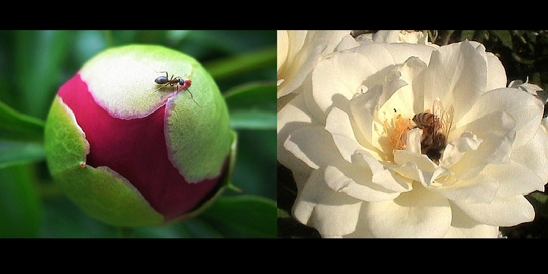

# AntsAndBees

Transfer learning for computer vision example. 

Convolutional neural network for classifying ant and bee images.

## Requirements

To get requirements, run the following commands (note this assumes your GPU is [CUDA-enabled](https://developer.nvidia.com/cuda-gpus)):

- `pip install -r requirements.txt`
- `pip install torch torchvision torchaudio --index-url https://download.pytorch.org/whl/cu117`

Download the dataset from [this link](https://download.pytorch.org/tutorial/hymenoptera_data.zip)

## Usage

To run the program, run the following command:

- `python main.py`
